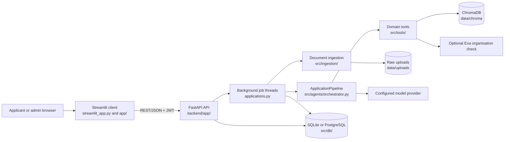
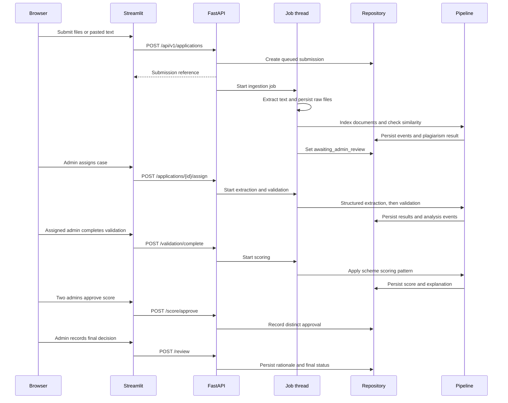
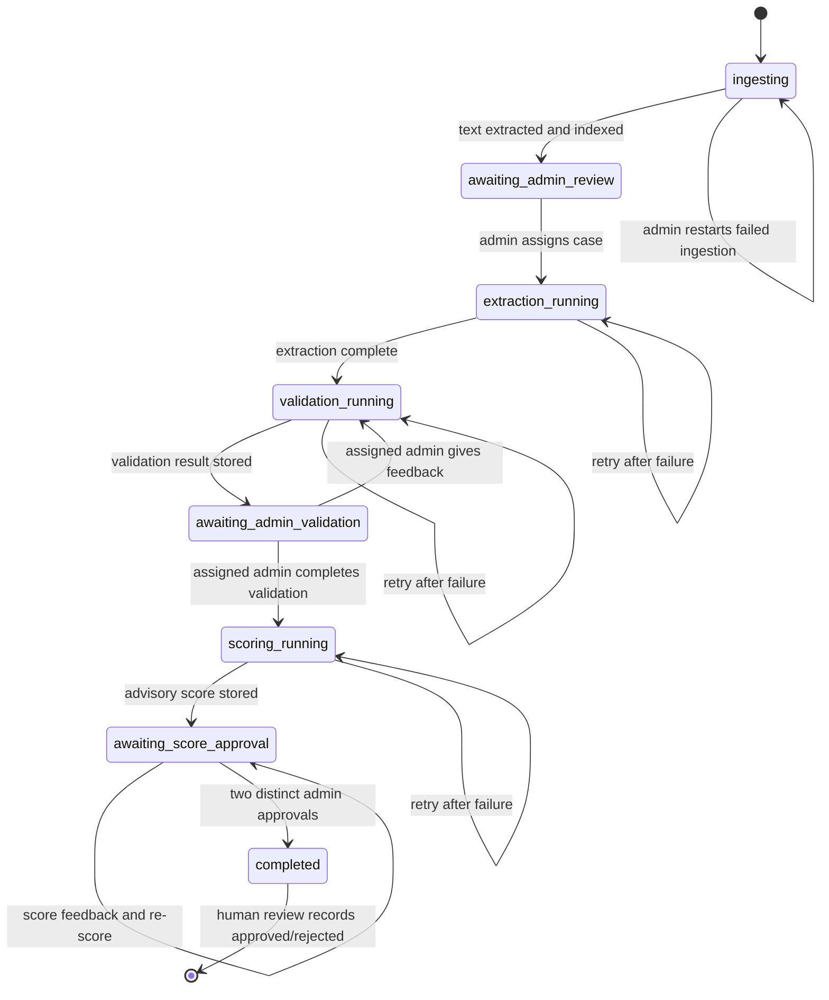
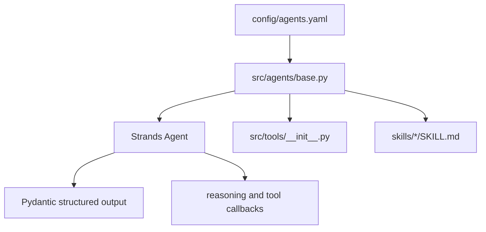

# Architecture Overview

This document describes the architecture that is implemented in the repository. It is intentionally specific to the current proof of concept, including its local storage defaults and its staged human-in-the-loop workflow.

## 1. Design Goals

The platform processes synthetic scheme applications while keeping the important boundaries explicit:

- The UI is a replaceable client, not the business-logic layer.
- AI produces structured, explainable advice; authorized humans make final decisions.
- Slow OCR, embedding, and model calls run outside the HTTP request path.
- Uploaded documents, extracted content, embeddings, events, and reviews remain auditable.
- Database and model providers are selected through configuration and adapters.

## 2. Runtime Topology



### Boundary rules

`app/` may import the API client and presentation helpers. It must not import `src.db`, `src.tools`, or `src.ingestion`. `backend/app/` is the HTTP and authorization boundary. `src/` contains reusable domain capabilities and is not coupled to Streamlit.

The single UI boundary is `BackendClient`:

```python
# app/views/applicant_views.py
from app.state import get_client

client = get_client()
result = client.submit_application(scheme_id, notes, pasted_text, files)
```

The client adds the bearer token and translates non-2xx responses into `BackendError`; it does not implement application rules.

## 3. Request and State Flow



The response to submission is intentionally immediate. Clients poll `GET /api/v1/applications/{id}` or `/status`; the admin view also polls the stored analysis event history when refreshed.

## 4. Application Processing Pipeline



The timeline stage is separate from `analysis_status`. `analysis_status` is the operational state (`queued`, `running`, `completed`, or `failed`); `timeline_stage` describes the business workflow and lets the UI mark the active failed stage rather than collapsing every failure into a generic state.

### Stage ownership

| Stage | Owner | Durable output |
| --- | --- | --- |
| Ingestion | `run_ingestion_job` | raw files, document manifest, combined text |
| Index and duplicate check | `ApplicationPipeline.index_and_check` | Chroma records and plagiarism result |
| Extraction | `run_extraction_and_validation_job` | extracted fields and summary |
| Validation | `ApplicationPipeline.run_validation` | completeness, eligibility, risks, organisation check |
| Scoring | `ApplicationPipeline.run_scoring` | score and explanation, including review notes |
| Score approval | application API routes | unique admin approvals, requiring two admins |
| Final review | `backend/app/api/reviews.py` | human decision and mandatory rationale |

Each agent returns a Pydantic result from `src/agents/results.py`. The orchestrator emits events through an `event_sink` callback:

```python
def sink(stage: str, event_type: str, content: str) -> None:
    db.append_analysis_event(submission_id, stage, event_type, content)

pipeline = create_orchestrator(event_sink=sink)
validation = pipeline.run_validation(
    extracted_fields,
    scheme,
    submitted_documents=document_manifest,
    plagiarism_summary=plagiarism_result,
    organisation_name=organisation_name,
    scoring_pattern=scoring_pattern,
)
```

## 5. Agents, Tools, and Skills

`config/agents.yaml` is the capability registry. `src/agents/base.py` loads an agent's tools from `src/tools/` and its on-demand instructions from `skills/` before constructing the Strands agent.



The current capability map is:

| Agent | Purpose | Tools | Skill |
| --- | --- | --- | --- |
| `embedding_agent` | Index complete document bundles | `embedding_tools` | `embedding-storage` |
| `extraction_agent` | Extract fields and summarize | `document_tools` | `document-extraction` |
| `validation_agent` | Check scheme requirements and risks | `validation_tools`, `verification_tools` | `completeness-validation` |
| `scoring_agent` | Apply explainable scheme scoring | `scoring_tools` | `explainable-scoring` |
| `scoring_pattern_agent` | Design a weighted scheme rubric | none | `scheme-scoring-design` |
| `workflow_agent` | Routing and audit capabilities | `workflow_tools` | `reviewer-workflow` |

Tools perform bounded domain operations. Skills provide instructions and policy context. Neither is a replacement for API authorization or the human review gate.

## 6. Persistence and Storage

The repository layer depends on the `Database` facade, not on a specific driver. `config/database.yaml` selects SQLite or PostgreSQL; adapters translate placeholders, DDL tokens, insert behavior, and duplicate-key errors.

```python
from src.db import repository as db

submission = db.get_submission(submission_id)
db.save_scoring_result(submission_id, score, explanation, feedback=feedback)
```

The important durable boundaries are:

| Data | Current location | Reason |
| --- | --- | --- |
| Users, schemes, submissions | SQLite by default, PostgreSQL supported | transactional application state |
| Raw uploads | `UPLOAD_STORAGE_DIR`, normally `data/uploads/` | retryable source documents |
| Extracted document manifest | `submissions.document_manifest` | document boundaries and extracted content |
| Embeddings and chunks | `CHROMA_PERSIST_DIRECTORY`, normally `data/chroma/` | local similarity and duplicate checks |
| Analysis events | `analysis_events` | reasoning/tool-use audit history |
| Human decisions | `reviews` | final authority and rationale |

The optional organisation verification tool sends only the organisation name to Exa when `EXA_API_KEY` is configured. Submission document content is not sent to that service.

## 7. Security and Trust Boundaries

- Login issues an HS256 JWT containing the user identity and role. The Streamlit session stores the token and `BackendClient` sends it on requests.
- FastAPI dependencies enforce authentication and role checks. Ownership and assigned-admin checks are server-side rules.
- Applicants can read their own submissions; admins can operate on the review queue.
- Final approval or rejection is only persisted by the human review route, with a required rationale.
- CORS is permissive for this POC and must be restricted before deployment.
- Set `JWT_SECRET_KEY` explicitly outside local development; the fallback secret is process-local and invalidates tokens on restart.

## 8. Failure and Retry Model

The job wrapper records an error event, sets `analysis_status=failed`, and leaves `timeline_stage` at the stage that failed. Admins can restart ingestion using the persisted raw files, which re-runs extraction/OCR rather than reusing a failed placeholder. Extraction, validation, and scoring retries are exposed through the workflow routes and feedback loops.

For production, replace daemon threads with a durable job queue and add idempotency/lease handling. The current threads are appropriate for the POC but do not survive process termination or provide distributed scheduling.
