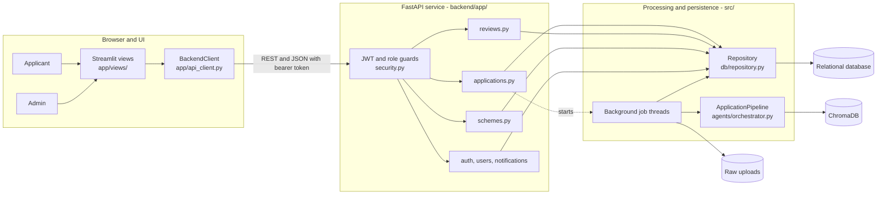
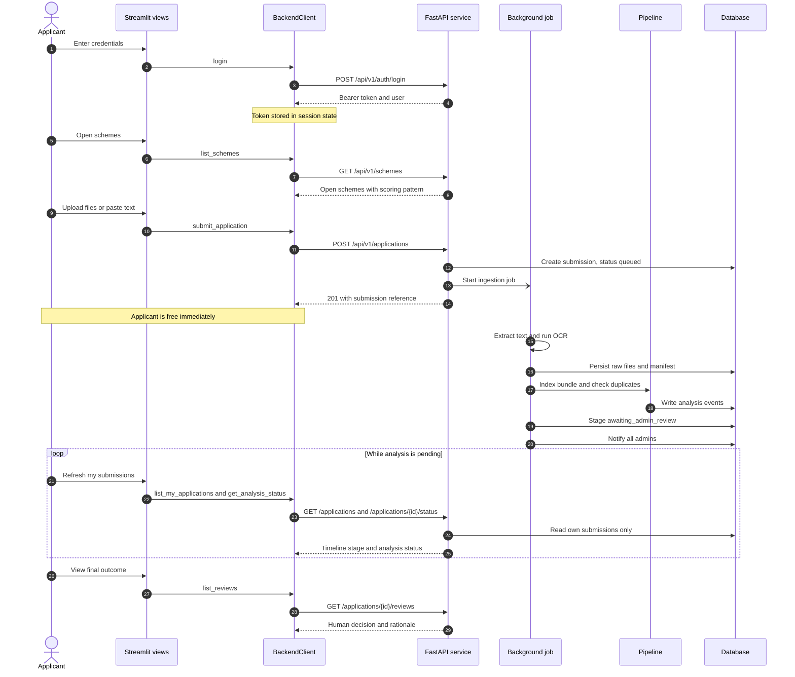
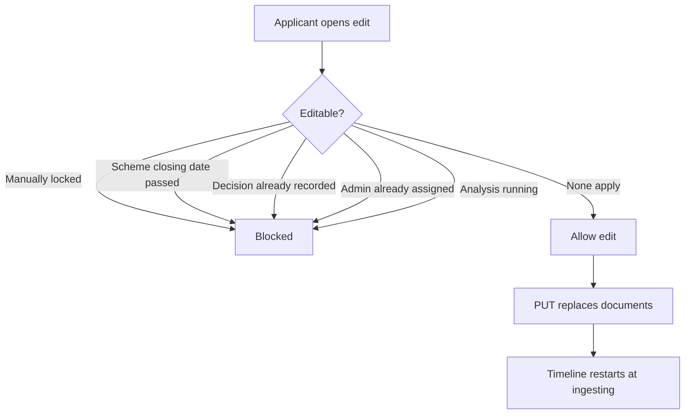
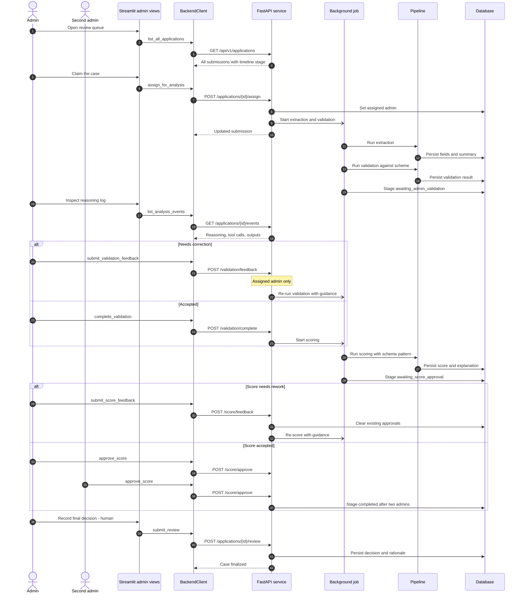
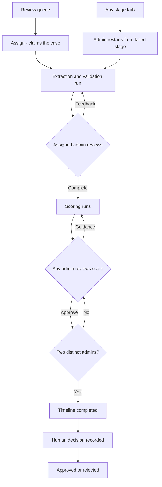
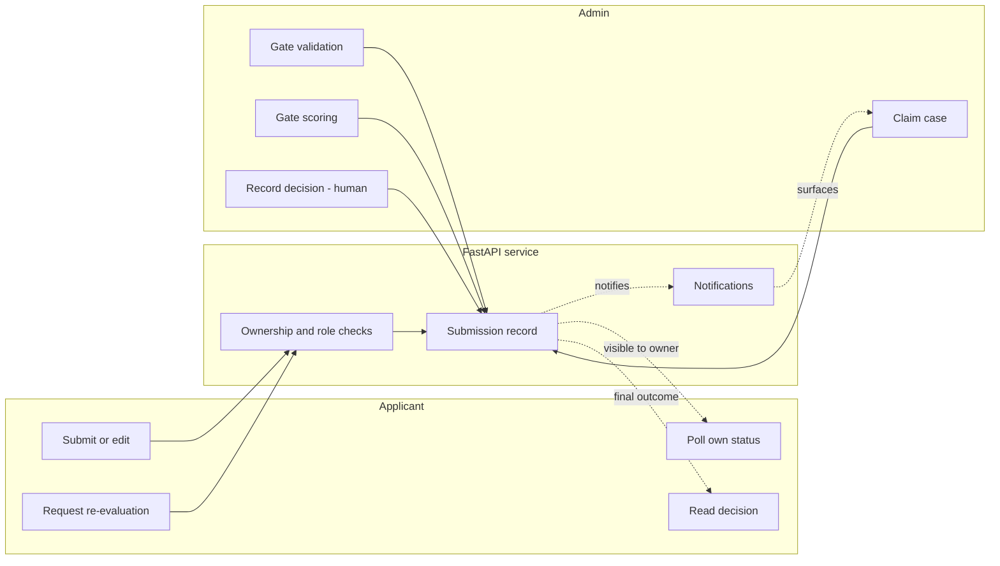

# UI, API, and Backend Service Interaction Flows

How the Streamlit client, the FastAPI service, and the background processing layer interact for a normal applicant submission and for admin users. Every route, stage, and guard shown here is taken from the implementation; see the source map in [architecture.md](architecture.md).

## Legend

| Notation | Meaning |
| --- | --- |
| Solid arrow | Synchronous call on the HTTP request path |
| Dotted arrow | Asynchronous work or polled read |
| Dashed reply in sequences | Response returned to the caller |
| Cylinder | Persistent store |
| "human" label | Action a person must take; never automated |

## 1. Interaction layers

Both actors use the same client and the same service. Only role and ownership change what the service permits.

The UI holds no business rules. `BackendClient` is the only place the UI crosses into the service, and the service is the only place authorization is enforced.

## 2. Normal submission flow - applicant

The submit call returns as soon as the upload bytes are read. All extraction, indexing, and duplicate checking happens on a background thread, so the applicant is never blocked by OCR or model latency.

### Applicant capabilities

| Action | Route | Server-side guard |
| --- | --- | --- |
| Register | `POST /api/v1/auth/register` | Always creates an applicant |
| Log in | `POST /api/v1/auth/login` | Credential check, issues JWT |
| Browse schemes | `GET /api/v1/schemes` | Authenticated |
| Submit | `POST /api/v1/applications` | Authenticated, requires file or text |
| Edit submission | `PUT /api/v1/applications/{id}` | Owner only and not locked |
| List own | `GET /api/v1/applications` | Filtered to the caller |
| Poll status | `GET /api/v1/applications/{id}/status` | Ownership check |
| Preview files | `GET /api/v1/applications/{id}/files` | Ownership check |
| Request re-evaluation | `POST /api/v1/applications/{id}/request-reevaluation` | Submitting applicant only |
| Read decisions | `GET /api/v1/applications/{id}/reviews` | Owner or admin |

An applicant cannot read the AI reasoning log. `GET /applications/{id}/events` is admin-only.

### Editability

An edit is accepted only while the submission is unlocked. The service computes one lock reason and publishes it on every submission response, so the UI displays the rule rather than reimplementing it.

## 3. Admin flow - staged review

Admins drive the pipeline in gated steps. Each gate is a separate call, and the AI never advances past a gate on its own.

### Admin gate summary

Two distinct rules apply at the gates. Validation feedback and completion are restricted to the admin who claimed the case. Score approval is open to any admin, but completion requires two different admins, enforced by a uniqueness constraint on the approvals table.

### Admin capabilities

| Area | Routes | Guard |
| --- | --- | --- |
| Queue and detail | `GET /applications`, `GET /applications/{id}` | Admin sees all |
| Reasoning log | `GET /applications/{id}/events`, `/events/stream` | Admin only |
| Claim case | `POST /applications/{id}/assign` | Admin, rejects double assignment |
| Validation loop | `POST /validation/feedback`, `POST /validation/complete` | Assigned admin only |
| Scoring loop | `POST /score/feedback`, `POST /score/approve` | Any admin, two needed to complete |
| Recovery | `POST /applications/{id}/restart`, `POST /applications/{id}/analyze` | Admin, failed or assigned case |
| Edit control | `POST /applications/{id}/lock`, `/unlock` | Admin |
| Final decision | `POST /applications/{id}/review` | Admin, rationale required |
| Schemes | `POST /schemes`, `PUT /schemes/{id}`, `POST /{id}/approve-update`, `PATCH /{id}/active`, `PATCH /{id}/closing-date` | Admin, edits need two approvals |
| Users | `GET /users`, `POST /users/admins`, `PATCH /{id}/active`, `POST /{id}/reset-password` | Admin |
| Notifications | `GET`, `POST`, `DELETE /notifications` | Read for all, write for admin |

## 4. Where the two flows meet

The submission record is the shared contract. Applicants and admins never call each other; they observe and mutate the same server-owned record under different permissions, and only the review route can set the final approved or rejected status.
